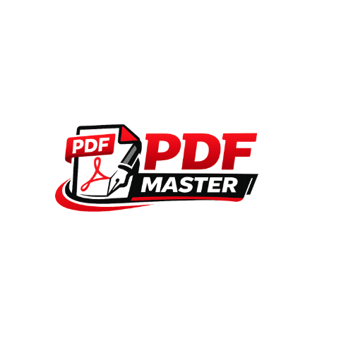

# PDF Master

A powerful, secure, and completely free online PDF editor. **PDF Master** brings advanced PDF tools directly to your browser, allowing you to edit, sign, protect, and manage your documents without any software installation.



## 🚀 Features

PDF Master offers a comprehensive suite of tools to handle all your PDF needs:

### 📝 Annotation & Editing
- **Annotate**: Highlight text, draw freehand, add shapes (rectangles, circles, arrows), and add sticky notes.
- **Multi-Tool Support**: Context-aware toolbars for precise control over colors, stroke widths, and opacities.
- **Undo/Redo**: Full history support for all annotation actions.

### 🔐 Security & Privacy
- **Protect PDF**: Encrypt your documents with password protection locally.
- **Unlock PDF**: Decrypt password-protected files safely in your browser.
- **100% Private**: All processing happens locally in your browser—your files never leave your device.

### 📄 Page Management
- **Organize**: Reorder pages with simpler drag-and-drop functionality.
- **Rotate & Delete**: Fix page orientation or remove unwanted pages.
- **Split & Merge**: Combine multiple files into one or split a large document into separate files.

### 🛠️ Advanced Tools
- **Convert**: Image to PDF and PDF to Image conversion.
- **Compress**: Reduce file size without losing quality.
- **Sign**: Add signatures to your documents.
- **Watermark**: Add text or image watermarks for copyright and branding.
- **Page Numbers**: Add pagination to your documents customizable by position and format.

## 💻 Tech Stack

- **Core**: [Next.js 16](https://nextjs.org/) (Turbopack)
- **Language**: Typescript
- **Styling**: [Tailwind CSS 4](https://tailwindcss.com/) & [Shadcn UI](https://ui.shadcn.com/)
- **PDF Engines**:
  - `pdf-lib` for modification
  - `muhammara` for complex operations
  - `@pdfsmaller` for encryption
  - `pdf.js` for rendering

## 📦 Installation & Development

### Prerequisites
- Node.js (v18 or higher)
- npm or yarn

### Getting Started

1. **Clone the repository**
   ```bash
   git clone https://github.com/EdilsonRogerioCuambe/pdf-editor-app.git
   cd pdf-editor-app
   ```

2. **Install dependencies**
   ```bash
   npm install
   ```

3. **Run locally (Development Mode)**
   ```bash
   npm run dev
   ```
   Open [http://localhost:3000](http://localhost:3000) with your browser to see the result.

4. **Build for Production**
   ```bash
   npm run build
   npm start
   ```

## 🏷️ Versioning

This project follows [Semantic Versioning](https://semver.org/).
- **Current Version**: `v0.1.0`

## 👥 Author

**Edilson Rogério Cuambe**
- GitHub: [@EdilsonRogerioCuambe](https://github.com/EdilsonRogerioCuambe)
- Email: edicuambe@gmail.com
